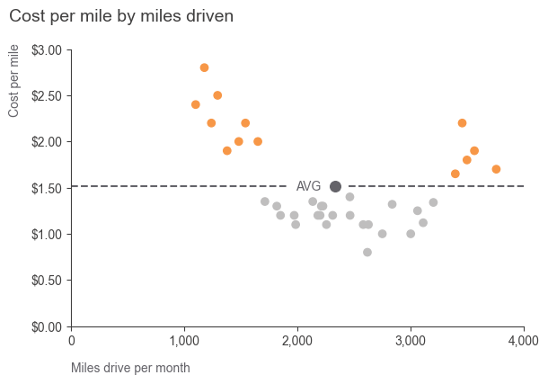

# Collection of data visualizations

Sources: Story telling with data, Cole Nussbaumer Knaflic, 2015  
Data: https://www.storytellingwithdata.com/book/downloads

## [Figure 1. Scatter plot](https://github.com/vaidasbog/data-viz/blob/main/code/scatter_plot_1.py)

## [Figure 2. Line plot](https://github.com/vaidasbog/data-viz/blob/main/code/line_plot_1.py)

## [Figure 3. Waterfall plot](https://github.com/vaidasbog/data-viz/blob/main/code/waterfall_1.py)

## [Figure 4. Horizontal bar plot](https://github.com/vaidasbog/data-viz/blob/main/code/hbar_plot_1.py)

## [Figure 5. Waffle plot](https://github.com/vaidasbog/data-viz/blob/main/code/waffle_plot_1.py)

## [Figure 6. Bar & Line plot overlay](https://github.com/vaidasbog/data-viz/blob/main/code/bar_and_line_overlay_plots.py)

## [Figure 7. Scatter plot](https://github.com/vaidasbog/data-viz/blob/main/code/scatter_plot_2.py)

## [Figure 8. Slopegraph](https://github.com/vaidasbog/data-viz/blob/main/code/slopegraph_1.py)

  

## [Figure 9. Line plot](https://github.com/vaidasbog/data-viz/blob/main/code/line_plot_2.py)

 

## [Figure 10. Bar plot](https://github.com/vaidasbog/data-viz/blob/main/code/bar_plot_1.py)

  

## [Figure 11. Progress line plot](https://github.com/vaidasbog/data-viz/blob/main/code/progress_line_plot.py)

  

## [Figure 12. Line plot](https://github.com/vaidasbog/data-viz/blob/main/code/line_plot_3.py)

  

## [Figure 13. Stacked bar plot](https://github.com/vaidasbog/data-viz/blob/main/code/bar_plot_2.py)

 

## [Figure 14. Stacked bar plot](https://github.com/vaidasbog/data-viz/blob/main/code/bar_plot_3.py)

 

## [Figure 15. Stacked bar plot](https://github.com/vaidasbog/data-viz/blob/main/code/hbar_plot_2.py)

 

## [Figure 16. Background colors](https://github.com/vaidasbog/data-viz/blob/main/code/background.py)

White background | Blue background | Black background
:-------------------------:|:-------------------------:|:-------------------------:
  |   | 

## [Figure 17. Line plot progression](https://github.com/vaidasbog/data-viz/blob/main/code/line_plot_progression.py)

1/5 | 2/5 | 3/5 | 4/5 | 5/5
:-------------------------:|:-------------------------:|:-------------------------:|:-------------------------:|:-------------------------:
  |   |  |  | 

Circulated version:
 

## [Figure 18. Horizontal bar plot](https://github.com/vaidasbog/data-viz/blob/main/code/hbar_plot_3.py)

 

# Presentation

1. Title slide
2. What is it about
- People who don't understand the plot tend to blaim them selves. But it's usually the fault of designer.
- Don't overcomplicate. If it's hard to read it's har to do. The more complicated it looks the more time your audience perceives it will take to understand it and the less likely they will spend time understanding it. 
- Aesthetically design are perceived as more readily accepted and used overtime and promote creative thinking pg. 145.
- When we pay attention to detail we create a conract with our audience so that they are obliged to spend more time with the graph.
3. 
4. Clutter
- Figure 3.13, 3.24, 3.15 vs. 3.16
5. Focus attention
- Figure 4.2 vs. 4.3, 4.14, 4.16
6. Design choices, text and etc.
- Fi. 5.10
6. No-go:
- Secondary axis, pie charts, 3D visuals
7. Best examples and use cases:
- <...>
- Line graphs to show tren over time.
8. Tips:
- Gray colors!!!
- Title is precious part - use for recommendation. pg. 141
- Z reading principle/ Figure 5.6.
- Include brand colors
- Formatting fonts?
- Caption to indlude data source and date of extraction.
- Show Fleetcor examples:
- BA template for matplotlib
- Axis labl formatting to include $,%, thousand separator
- These design choices are not for everyone: pg.149. 
- Poor design choises in Fleetcor: Box plot, tables without colors etc.
- Use text it to label, explain, reinforce, highligh, recommend and tell a story.
- Label axis and have titles to reduce time needed to understant how to read the plot.
- 

X. References

# Notebook
1 Example with BA colors and font

# Quick access:
* Get tick labels in a list; Modify tick labels; Set new tick labels;

# TODO
Quick access:
* Percent formatter of axis (hbar_plot_1.py)
* Number of tick in axis (see: tick locators, bar_plot_2.py)
* Custom tick label values (see FixedFormatter, bar_plot_2.py)
* Custom legend (bar_plot_2.py)

# Usefull links
https://matplotlib.org/stable/gallery/ticks_and_spines/tick-locators.html
https://matplotlib.org/3.1.1/gallery/ticks_and_spines/tick-formatters.html
https://matplotlib.org/stable/gallery/ticks_and_spines/major_minor_demo.html
https://matplotlib.org/stable/tutorials/intermediate/legend_guide.htmlv